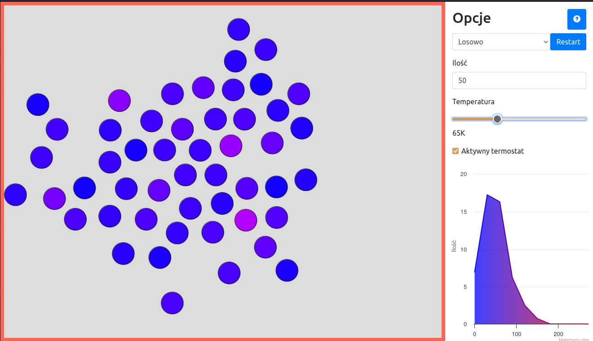

# [EN] Simulation of LJ potential in argon gas
Simple particle interaction. Also implements thermostat.

Visit [live version](https://madghostek.github.io/Argon-LJ-Potential/model_argonu.html), or clone the repo and open `model_argonu.html` in browser (requires internet connection)

# [PL] Symulacja potencjału LJ w argonie
Prosta symulacja interakcji między cząstkami. Jest też termostat

Odwiedź [wersję na żywo](https://madghostek.github.io/Argon-LJ-Potential/model_argonu.html), lub sklonuj repo i uruchom `model_argonu.html` w przeglądarce (wymagane połączenie internetowe)

